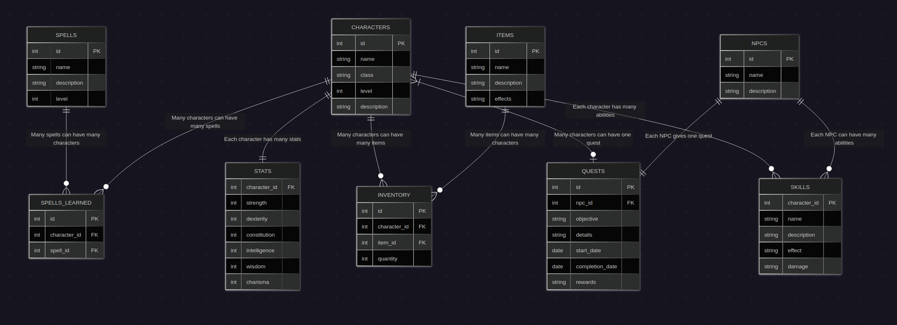
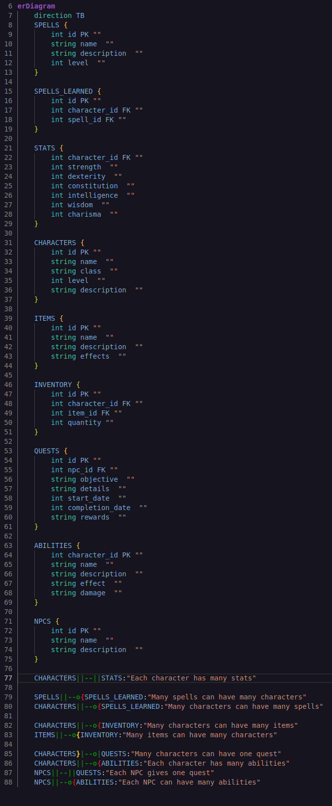

# D&D Database

The D&D database is a database that can store a bunch of information for your D&D campaign, like the characters, stats, spells, quests, and more. It uses python to create a user interface to interact with the database.

## ERD





## Installation
``` bash
1. git clone https://github.com/DexterityB/dnd-database-project.git

2. cd dnd-database-project

3. pip install mysql-connector-python

4. pip install tabulate
```

## Usage 
To run python menu
``` python
1. python3 main.py
```
To make docker container and create database
```bash
1. docker run --name dnd-database   -e MYSQL_ROOT_PASSWORD=password   -p 3306:3306   -d mysql:latest

2. docker start dnd-database

3. docker exec -it dnd-database mysql -uroot -ppassword < schema.sql
```

## Example Usage
```
🗡️  D&D Database Manager 🐉
==========================
1. View Table
2. Character Menu
3. Spell Menu
4. Quest Menu
5. Npc Menu
6. Item Menu
7. Exit
Selection: 1

List of available tables: ['characters', 'inventory', 'items', 'npcs', 'quests', 'skills', 'spells', 'spells_learned', 'stats']
Table name: characters

+------+---------------------+-------------------+---------+------------------------------------------+
|   ID | NAME                | CHARACTER_CLASS   |   LEVEL | DESCRIPTION                              |
+======+=====================+===================+=========+==========================================+
|    1 | Aelar Stormwind     | Wizard            |      12 | Elven archmage of the northern towers    |
+------+---------------------+-------------------+---------+------------------------------------------+
|    2 | Brakus Ironfist     | Fighter           |      10 | Dwarven arena champion                   |
+------+---------------------+-------------------+---------+------------------------------------------+
|    3 | Lyra Moonwhisper    | Rogue             |       8 | Silent thief from the shadow guild       |
+------+---------------------+-------------------+---------+------------------------------------------+
|    4 | Thalion Brightleaf  | Druid             |      11 | Protector of the ancient forest          |
+------+---------------------+-------------------+---------+------------------------------------------+
|    5 | Seraphina Dawn      | Cleric            |       9 | Healer of the sun temple                 |
+------+---------------------+-------------------+---------+------------------------------------------+
|    6 | Darius Blackthorn   | Warlock           |      13 | Pact-bound seeker of forbidden knowledge |
+------+---------------------+-------------------+---------+------------------------------------------+
|    7 | Kael Windrider      | Ranger            |       8 | Hunter of all the world's wilds          |
+------+---------------------+-------------------+---------+------------------------------------------+
|    8 | Mira Frostveil      | Sorcerer          |      10 | Wielder of ice-born magic                |
+------+---------------------+-------------------+---------+------------------------------------------+
|    9 | Gorim Stonebeard    | Paladin           |      14 | Holy knight of the mountain order        |
+------+---------------------+-------------------+---------+------------------------------------------+
|   10 | Elyndra Nightbreeze | Bard              |      12 | Traveler who holds forgotten concerts    |
+------+---------------------+-------------------+---------+------------------------------------------+
|   13 | George Smith        | Rogue             |       5 | Brother of long lost John Smith          |
+------+---------------------+-------------------+---------+------------------------------------------+

🗡️ D&D Database Manager 🐉
==========================
1. View Table
2. Character Menu
3. Spell Menu
4. Quest Menu
5. Npc Menu
6. Item Menu
7. Exit
Selection: 2

🧙 Character Menu 👑
====================
1. Add Character
2. Update Character
3. Delete Character
4. Add Skill
5. Update Skill
6. Delete Skill
7. Main Menu
Selection: 3
Input Character ID: 13
✅ Successfully deleted data from database ✅
```

## Testing

To add example data and see example queries
``` bash
1. docker exec -it dnd-database mysql -uroot -ppassword < data.sql

2. docker exec -it dnd-database mysql -uroot -ppassword < queries.sql
```

## Table Descriptions

- Characters
    - Gives info about each player's name, class, current level, and description of their character  
- Stats
    - Defines a character’s physical and mental capabilities to determine success on dice rolls
- Spells Learned
    - Used to connect Characters and Spells tables 
- Spells
    - Magical effects that allow characters to perform supernatural feats such as dealing damage or healing wounds
- Inventory
    - Used to connect Character and Items tables 
- Items
    - Mundane or magical objects that are used to enhance abilities, provide utility, or offer protection
- Skills
    - Specific applications of the six core stats used to determine the success of uncertain actions
- Quests
    - Defined objectives or missions that drive the narrative forward
- Npcs
    - Any character in the game world controlled by the DM, providing information, plot hooks, or opposition to drive the story. 

## Features List

- Display the data of any table
- Character Menu
    - Add, edit, & delete characters/stats
    - Add, edit, & delete skills
- Spell Menu
    - Add, learn, & update spells
- Quest Menu
    - Add, edit, & delete quests
- NPC Menu
    - Add, edit, & delete NPCs
- Item Menu
    - Add, edit, & delete items

## Known Bugs or Limitations

The main limitation for the database is that when updating data, you have to update the whole row. The easiest way to deal with this is to display the table right before you edit a row, that way you can just copy the data you don't want to be changed, but it's still a limitation.

## Reflection

Throughout the design process of this project, we learned a lot about using databases and the database mangager in python. During the design of our database, we learned how to a more complex database than we've designed before, with more tables, where all of the tables interact. We also learned about truncate commands and resetting auto incrementing IDs, although we didn't end up implementing that in our final project.

During the construction of our python programs, we learned about utilizing different functions to better organize our design, allowing us to not just have a bunch of spaghetti code. While we have done this in the past, this project was a lot bigger than a lot of previous projects, which is why we used this method as much as we did. In addition, we also utilized try except functions a lot more than we previously have.

For the interaction between our python application and our SQL database, we learned more about parameterized queries, and what parts of SQL queries can be parameterized. For example, we weren't able to use the '%s' to input table or column names into the queries, but could prevent SQL injection using other error handling methods. We also were able to use different methods in our database file to use a small number of functions, like calculating different numbers of '%s' required and then inputting them into the query.